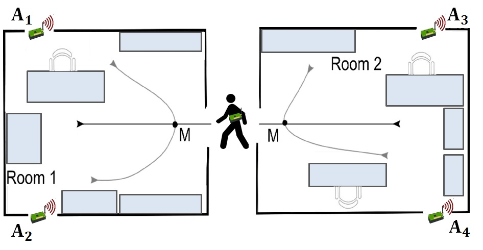

# Indoor_Movement_TimeSeries_Classification_with_Machine_Learning_Algorithms

Indoor movement prediction involves using wireless sensor strength data to predict the location and motion of subjects within a building.
It is a challenging problem as there is no direct analytical model to translate the variable length traces of signal strength data from multiple sensors into user behavior.
The ‘indoor user movement‘ dataset is a standard and freely available time series classification problem.
In this tutorial, you will discover the indoor movement prediction time series classification problem and how to engineer features and evaluate machine learning algorithms for the problem.

The content of dataset is the following:

- directory "dataset" contains the input and ground-truth (target) data (csv format)
- directory "groups" contains the information pertaining to the data grouping based on the environment and on the path type
 (csv format)
- figure "MovementAAL.jpg" contains a sketch of the common setup considered for the measurement campaign in real-life office environments

- file "dataset_description.txt" contains a brief description of the dataset
